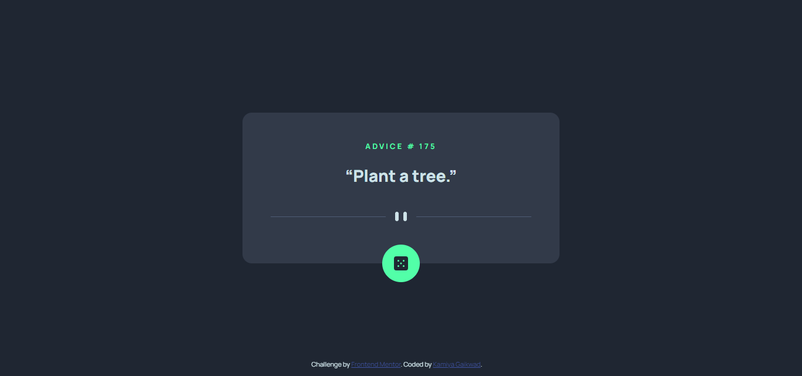

# Frontend Mentor - Advice generator app solution

This is a solution to the [Advice generator app challenge on Frontend Mentor](https://www.frontendmentor.io/challenges/advice-generator-app-QdUG-13db). Frontend Mentor challenges help you improve your coding skills by building realistic projects.

## Table of contents

- [Overview](#overview)
  - [The challenge](#the-challenge)
  - [Screenshot](#screenshot)
  - [Links](#links)
- [My process](#my-process)
  - [Built with](#built-with)
  - [What I learned](#what-i-learned)
  - [Continued development](#continued-development)
  - [Useful resources](#useful-resources)
- [Author](#author)
- [Acknowledgments](#acknowledgments)

## Overview

### The challenge

Users should be able to:

- View the optimal layout for the app depending on their device's screen size
- See hover states for all interactive elements on the page
- Generate a new piece of advice by clicking the dice icon

### Screenshot



### Links

- Solution URL: [Github](https://github.com/KamiyaGaikwad/advice-generator-app-main)
- Live Site URL: [Netlify](https://frontend-advicegeneratorapp-challenge.netlify.app/)


## My process

### Built with

- Semantic HTML5 markup
- CSS custom properties
- Flexbox
- Mobile-first workflow
- [React](https://reactjs.org/) - JS library

### What I learned

I learnt to add glow effect on hover.

To see how you can add code snippets, see below:

```css
.dice-div:hover{
  box-shadow: 0 0 3.125rem var(--neon-green);
}
```

### Useful resources

- [w3schools](https://www.w3schools.com/howto/howto_css_glowing_text.asp) - This helped me to add glow effect on hover.

## Author

- Website - [Kamiya Gaikwad](https://www.your-site.com)
- Frontend Mentor - [@KamiyaGaikwad](https://www.frontendmentor.io/profile/KamiyaGaikwad)
- Twitter - [@Kamiya_Gaikwad](https://www.twitter.com/Kamiya_Gaikwad)
